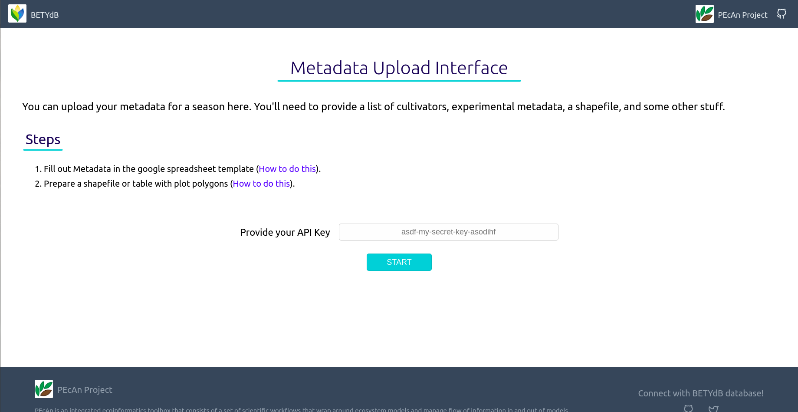
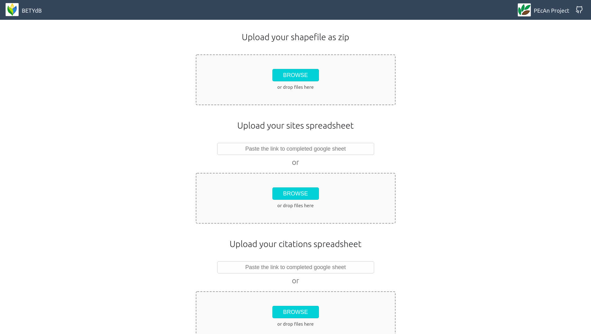
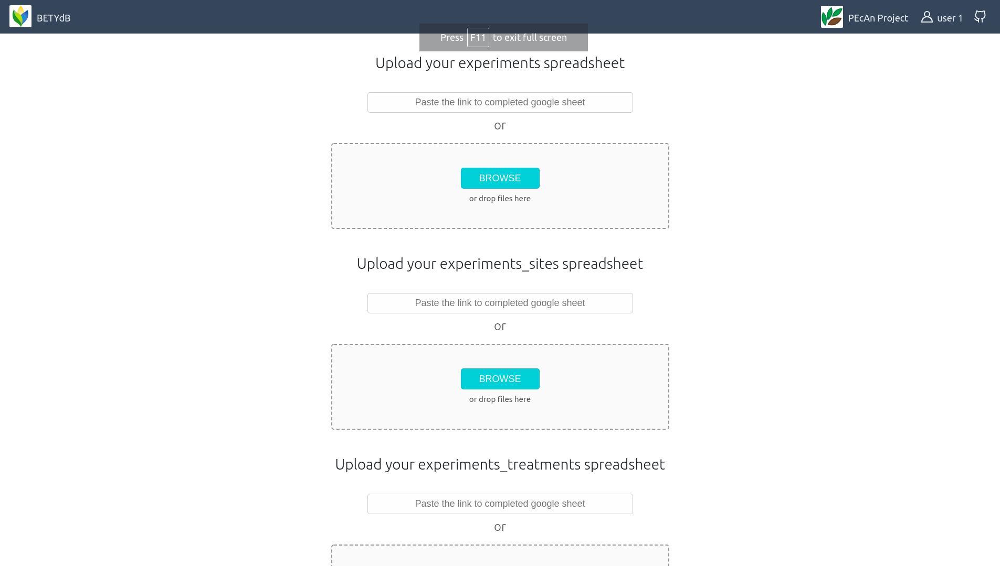
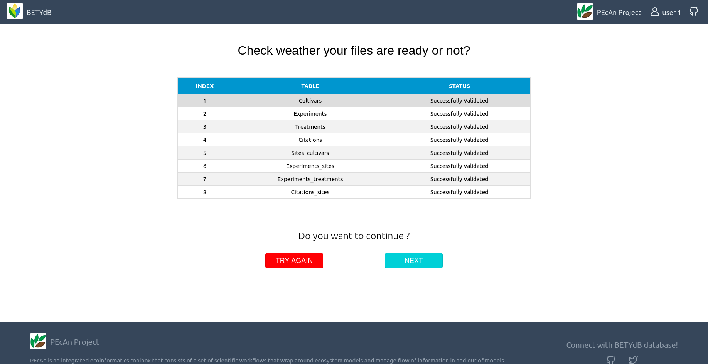
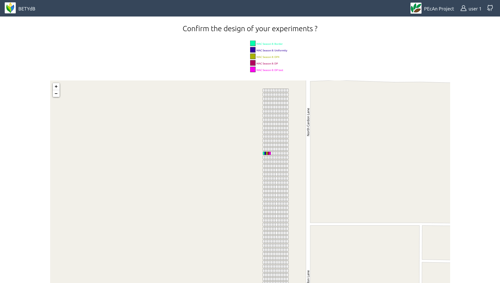
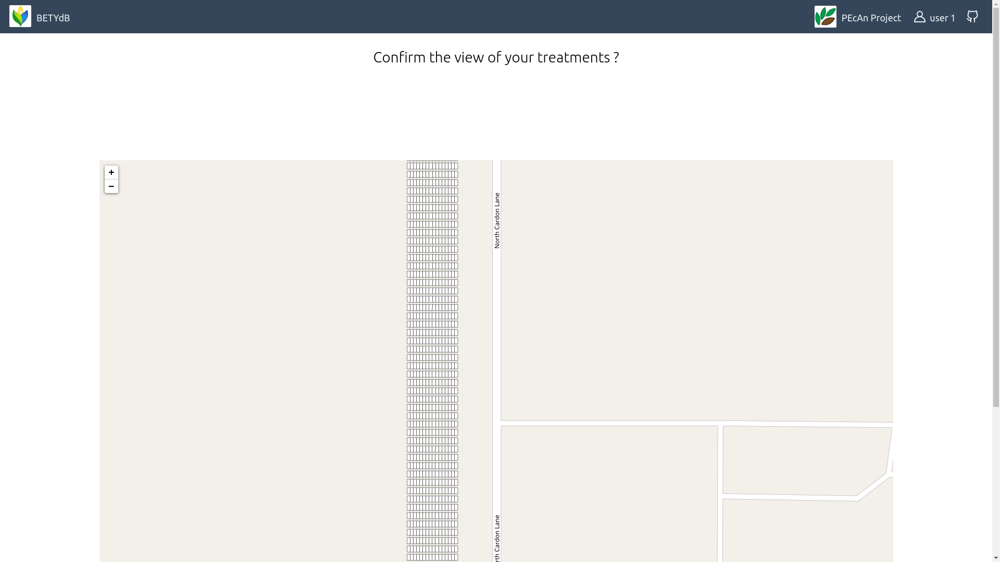
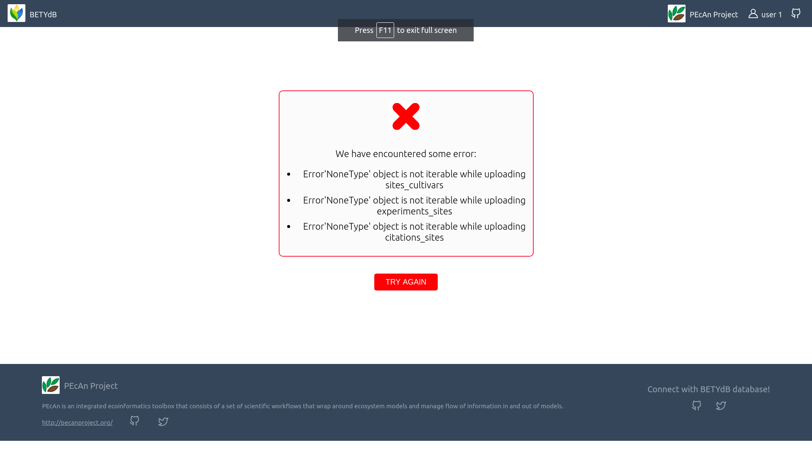
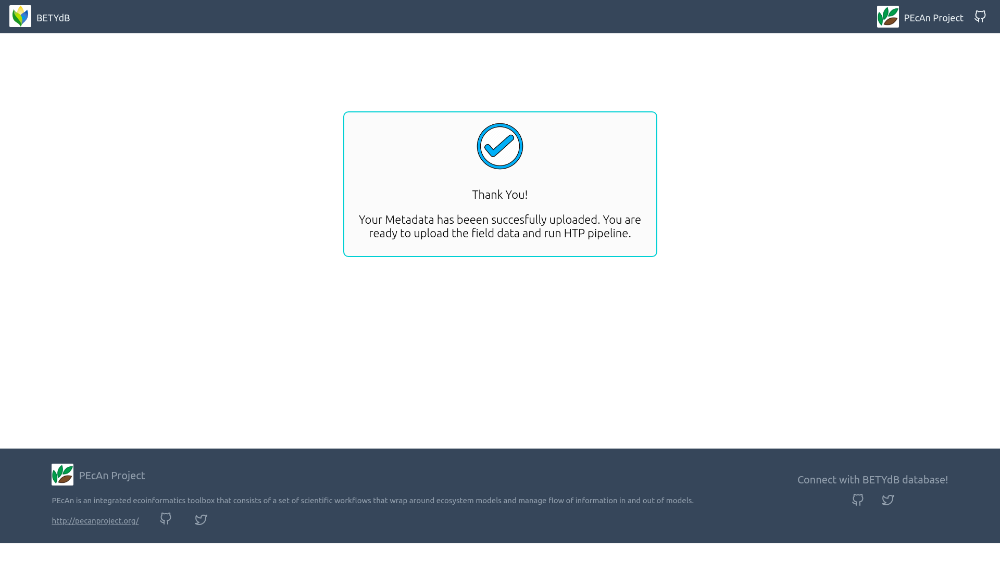

[](https://opensource.org/licenses/BSD-3-Clause)
[](https://travis-ci.org/saurabh1969/BETYdb-YABA)

#  BETYdb-YABA

Another BETYdb-YABA app for Metadata Upload for seasons using the GUI.
Developed as part of Google Summer of Code 2019 and 2020.

## Table of Contents

  - [Getting Started](#getting-started)
    - [Prerequisites](#prerequisites)
    - [Setup BETYdb](#setup-betydb)
    - [Running the App](#running-the-app)
  - [Steps to Upload Metadata](#steps-to-upload-metadata)
  - [Schema and Format of the Tables](#schema-and-format-of-the-tables)
    - [Cultivars](#cultivars)
    - [Experiments](#experiments)
    - [Treatments](#treatments)
    - [Citations](#citations)
    - [Sites](#sites)
    - [Sites cultivars](#sites-cultivars)
    - [Experiments sites](#experiments-sites)
    - [Experiments treatments](#experiments-treatments)
    - [Citations sites](#citations-sites)
  - [Screenshots](#screenshots)
  - [Developer's Documentation](#developers-documentation)
	- [Working of the YABA app](working-of-the-yaba-app-works)
    - [Hit the YABA API endpoints](#hit-the-yaba-api-endpoints)
    - [Hit the Client Endpoints](#hit-the-client-endpoints)
  - [Previous Year GSoC Reports](#previous-year-gsoc-reports)
  - [Contributing](#contributing)
  - [License](#license)

## Getting Started

### Prerequisites

* Docker
  * Install docker based on your OS from [here](https://www.docker.com/get-started)
* Docker Compose
  * Installation instructions for docker-compose from [here](https://docs.docker.com/compose/install/)

### Setup BETYdb

Following commands can be used to initialize the database to be used 
with YABA development.

```bash
docker-compose up -d postgres
docker-compose run --rm bety initialize
docker-compose run --rm bety sync
```

### Running the App

Once you have completed this step, YABA interface will be running and you can upload your Metadata at [localhost:3001](http://localhost:3001/)

#### Bring up the containers at once

```sh
docker-compose up
```

#### Bring up container for YABA-API

If you only want to run the yaba-api, not the interface and yaba-client, you can do this.

```sh
docker-compose up -d yaba_api
```

### Running the App without initialization and synchronization of bety

Once you have completed this step, YABA interface will be running and you can upload your Metadata at [localhost:3001](http://localhost:3001/)

#### Skip the "Setup BETYdb" step and bring up the containers at once

```sh
# Bring up full stack
docker-compose up
```

## Steps to Upload Metadata

1. Enter your API key
2. Upload your shapefile and different tables
3. Check whether your tables are valid or not
4. Confirm the design of your cultivars
5. Confirm the design of your experiments
6. Confirm the design of your treatments
7. You will be redirected to the success page if the upload is successful.

## Schema and Format of the Tables

### Cultivars

| field     | type      | notes | required |
|-----------|-----------|-------|----------|
| name      | character |       | yes      |
| species   | character |       | yes      |
| ecotype   | character |       | no       |
| notes     | character |       | no       |

### Experiments

| field       | type      | notes                        | required |
|-------------|-----------|------------------------------|----------|
| name        | character |                              | yes      |
| start_date  | date      | must be in format yyyy-mm-dd | yes      |
| end_date    | date      | must be in format yyyy-mm-dd | yes      |
| description | character |                              | no       |
| design      | character |                              | no       |


### Treatments

| field  | type | notes | required |
|-|-|-|-|
| name | character |  | yes |
| definition | character |  | yes |
| control | boolean | either 't' or 'f'  | yes |
| experiment | character | this should exactly match an experiment name inputted in the 'name' field of the experiments sheet; if associated with more than one experiment, separate names with a space and comma | yes |

### Citations

| field   | type      | notes      | required |
|---------|-----------|------------|----------|
| author  | character |            | yes      |
| year    | numeric   |            | yes      |
| title   | character |            | yes      |
| journal | character |            | no       |
| volume  | numeric   |            | no       |
| page    | character | page range | no       |
| url     | character |            | no       |
| pdf     | character |            | no       |
| doi     | character |            | no       |

### Sites

Cultivar and species combination for each site must be present in the cultivars sheet

| field  | type | notes | required |
|-|-|-|-|
| sitename | character | must be unique | yes |
| city | character |  | no |
| state | character |  | no |
| country | character |  | no |
| notes | character |  | no |
| greenhouse | boolean | either 't' or 'f' | no |
| geometry | geometry | must provide shapefile | yes |
| time_zone | character |  | no |
| cultivar | character | this should exactly match a cultivar name inputted in the 'name' field of the cultivars sheet | yes |
| species | character | this should exactly match a species name inputted in the 'species' field of the cultivars sheet | yes |
| experiment | character | this should exactly match an experiment name inputted in the 'name' field of the experiments sheet | yes |

### Sites cultivars

| field         | type      | notes                                                                                                | required |
|---------------|-----------|------------------------------------------------------------------------------------------------------|----------|
| cultivar_name | character | this should exactly match a cultivar name inputted in the 'name' field of the cultivars sheet        | yes      |
| specie_id     | numeric   | this should exactly match an id of cultivar name inputted in the 'name' field of the cultivars sheet | yes      |
| sitename      | character | this should exactly match a site inputted in the 'sitename' field of the sites sheet                 | yes      |

### Experiments sites

| field           | type      | notes                                                                                                | required |
|-----------------|-----------|------------------------------------------------------------------------------------------------------|----------|
| experiment_name | character | this should exactly match a experiment name inputted in the 'name' field of the experiments sheet    | yes      |
| sitename        | character | this should exactly match a site inputted in the 'sitename' field of the sites sheet                 | yes      |

### Experiments treatments

| field           | type      | notes                                                                                             | required |
|-----------------|-----------|---------------------------------------------------------------------------------------------------|----------|
| experiment_name | character | this should exactly match a experiment name inputted in the 'name' field of the experiments sheet | yes      |
| treatment_name  | character | this should exactly match a treatment name inputted in the 'name' field of the treatments sheet   | yes      |

### Citations sites

| field    | type      | notes                                                                                         | required |
|----------|-----------|-----------------------------------------------------------------------------------------------|----------|
| author   | character | this should exactly match a author name inputted in the 'author' field of the citations sheet | yes      |
| year     | numeric   | this should exactly match a year inputted in the 'year' field of the citations sheet          | yes      |
| title    | character | this should exactly match a title inputted in the 'title' field of the citations sheet        | yes      |
| sitename | character | this should exactly match a site inputted in the 'sitename' field of the sites sheet          | yes      |

## Screenshots

### Homepage


### Upload 1


### Upload 2


### Validation page


### Cultivar Design page


### Experiments Design Page


### Treatments Design Page


### Error Page


### Success Page


## Developer's Documentation

### Working of the YABA app

The YABA app runs using Docker and there are different containers running different parts of the app,

**postgres:** Runs the container for Postgresql with postgis docker image to hold the data.

**bety:** Runs the container for BETY database docker image.

**yaba_app:**  Runs the python code in the app folder of the repository. Contains the code for YABA API endpoints (Developed using Connexion and Flask).

**yaba_client:**  Runs the python code in the client folder of the repository. Contains the code for YABA Client endpoints (Developed using Flask).

**yaba_interface:**  Runs the javascript code in the interface folder of the repository. Contains the code for interface of the YABA app (Developed using React JS).

**yaba_visualization:**  Runs the javascript code in the visualization folder of the repository. Contains the code for visualization component of the YABA app (Developed using Node JS).

### Hit the YABA API endpoints

Following endpoints can be used to upload Metadata to respective tables in bety.

Experiments: (to experiments table):

```sh
curl -F "fileName=@input_files/experiments.csv"   \
     http://localhost:5001/yaba/v1/experiments?username=guestuser
```

Sites: (to sites table)

```sh
curl -F "fileName=@input_files/sites.csv"   \
     -F "shp_file=@input_files/S8_two_row_polys.shp"  \
     -F "dbf_file=@input_files/S8_two_row_polys.dbf"  \
     -F "prj_file=@input_files/S8_two_row_polys.prj"  \
     -F "shx_file=@input_files/S8_two_row_polys.shx"  \
     http://localhost:5001/yaba/v1/sites
```

Treatments: (to treatments table)

```sh
curl -F "fileName=@input_files/treatments.csv"   \
     http://localhost:5001/yaba/v1/treatments?username=guestuser
```

Cultivars: (to cultivars table)

```sh
curl -F "fileName=@input_files/cultivars.csv"   \
     http://localhost:5001/yaba/v1/cultivars
```


Citations: (to citations table)

```sh
curl -F "fileName=@input_files/citations.csv"   \
     http://localhost:5001/yaba/v1/citations?username=guestuser
```

Experiments_sites: (to experiments_sites table)

```sh
curl -F "fileName=@input_files/experiments_sites.csv"   \
     http://localhost:5001/yaba/v1/experiments_sites
```
Experiments_treatments: (to experiments_treatments table)

```sh
curl -F "fileName=@input_files/experiments_treatments.csv"   \
     http://localhost:5001/yaba/v1/experiments_treatments
```

Sites_cultivars: (to sites_cultivars table)

```sh
curl -F "fileName=@input_files/sites_cultivars.csv"   \
     http://localhost:5001/yaba/v1/sites_cultivars
```

Citations_sites: (to citations_sites table)
 
```sh
curl -F "fileName=@input_files/citations_sites.csv"   \
     http://localhost:5001/yaba/v1/citations_sites
```

### Hit the Client Endpoints

Following endpoints can be used to upload Metadata to respective tables in bety.

Experiments: (to experiments table):

```sh
curl -F "fileName=@input_files/experiments.csv"   \
     http://localhost:6001/experiments?username=guestuser
```

Sites: (to sites table)

```sh
curl -F "fileName=@input_files/sites.csv"   \
     -F "shp_file=@input_files/S8_two_row_polys.shp"  \
     -F "dbf_file=@input_files/S8_two_row_polys.dbf"  \
     -F "prj_file=@input_files/S8_two_row_polys.prj"  \
     -F "shx_file=@input_files/S8_two_row_polys.shx"  \
     http://localhost:6001/sites
```

Treatments: (to treatments table)

```sh
curl -F "fileName=@input_files/treatments.csv"   \
     http://localhost:6001/treatments?username=guestuser
```

Cultivars: (to cultivars table)

```sh
curl -F "fileName=@input_files/cultivars.csv"   \
     http://localhost:6001/cultivars
```


Citations: (to citations table)

```sh
curl -F "fileName=@input_files/citations.csv"   \
     http://localhost:6001/citations?username=guestuser
```

Experiments_sites: (to experiments_sites table)

```sh
curl -F "fileName=@input_files/experiments_sites.csv"   \
     http://localhost:6001/experiments_sites
```
Experiments_treatments: (to experiments_treatments table)

```sh
curl -F "fileName=@input_files/experiments_treatments.csv"   \
     http://localhost:6001/experiments_treatments
```

Sites_cultivars: (to sites_cultivars table)

```sh
curl -F "fileName=@input_files/sites_cultivars.csv"   \
     http://localhost:6001/sites_cultivars
```

Citations_sites: (to citations_sites table)
 
```sh
curl -F "fileName=@input_files/citations_sites.csv"   \
     http://localhost:6001/citations_sites
```

## Previous Year GSoC Reports

- [GSOC 2020 Report](https://osf.io/v7f9t/wiki/GSOC%202020%20Report/)
- [GSOC 2020 Roadmap](https://osf.io/v7f9t/wiki/GSOC%202020%20Roadmap/)
- [GSOC 2019 Report and Workplan](https://osf.io/v7f9t/wiki/GSOC%202019%20Workplan%20and%20Summary/)

## Contributing

Contributions are what make the open-source community such an amazing place to learn, inspire, and create.  Your contributions could be as simple as fixing the indentations or typos to as complex as bringing new modules and features. **Any contributions you make are greatly appreciated.**

#### First-time Open Source contributors
Please note that BETYdb-YABA is beginner-friendly. If you have never done any open-source yet, we encourage you to do so. **We will be happy and proud of your first PR ever.**

You can begin with resolving any [open issues](https://github.com/PecanProject/BETYdb-YABA/issues).

## License
It is distributed under the BSD 3-Clause license. See [LICENSE](https://github.com/PecanProject/BETYdb-YABA/blob/master/LICENSE) for more information.